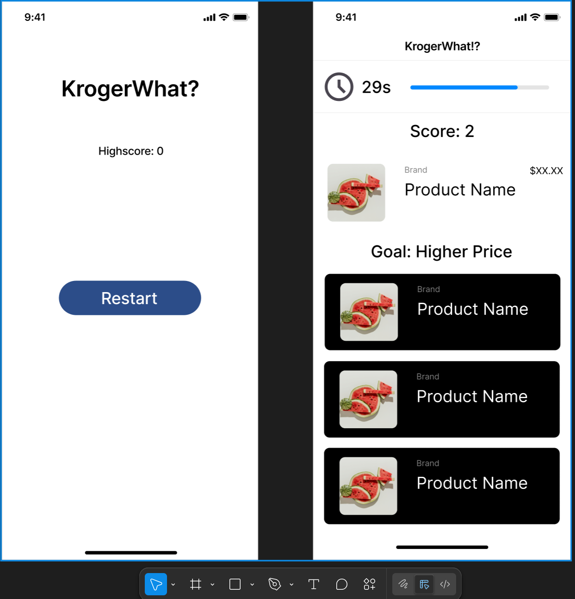
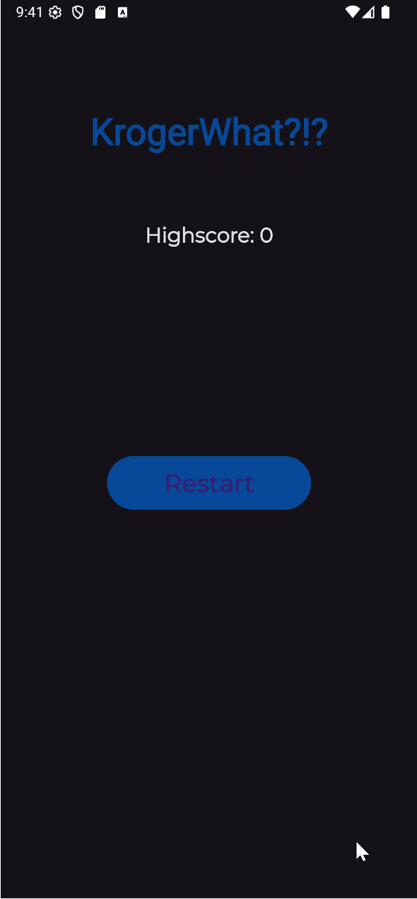
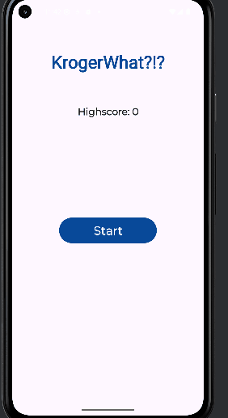

# **Kroger What!?**

## Table of Contents

1. [App Overview](#App-Overview)
2. [Product Spec](#Product-Spec)
3. [Wireframes](#Wireframes)
4. [Build Notes](#Build-Notes)

## App Overview

### Description 

**Description of your app**

### App Evaluation

<!-- Evaluation of your app across the following attributes -->

- **Category:** Entertainment
- **Mobile:** While our app may be played on the web, many users would appreciate the simplicity a mobile interface provides. Its elegant button usage allows the user to easily tap away at any choice they so desire. Additionally, users have the added pleasure of bragging to their friends when they hit a new top score.
- **Story:** Historically, the price is right has done very well. So tacking on a NEW Kroger edition™️ to it will make it all the rage!
- **Market:** This app serves double purpose for Kroger fans; they get to learn the latest grocery prices AND have some nice family fun.
- **Habit:** Within just a few games, a user can quickly find themselves addicted to guessing Kroger prices. It's like gambling, but without having to spend real money.
- **Scope:** The main difficulty with creating this app will be in figuring out how to work with the API to get a random selection of products to compare their prices to.

## Product Spec

### 1. User Features (Required and Optional)

Required Features:

- **Buttons to allow user to select choice**
- **Product name**
- **Product price (hidden to user)

Stretch Features:

- **Menu Screen*
- **Product image**
- **Scoring system**

### 2. Chosen API(s)

- **Kroger Products API**
  - **Get product name**
  - **Get product price**
  - **Get product image**

### 3. User Interaction

Required Feature

- **Button choice**
  - => **If in menu, starts the game**
  - => **If in game, locks in player's choice of item that is higher/less priced**
  - ...
- **Multiple products**
  - => **Player can see and interact with multiple product choices**

## Wireframes

<!-- Add picture of your hand sketched wireframes in this section -->

## Build Notes

The following is our first prototype of the app. In this version, API calls have not been made yet, but we laid the groundworks for basic game functionality.

Victor was able to discover a way to call the API. However, this version had significant latency issues that still needed debugging.

## License

Copyright **2025** **Victor Sim, Christian Galvez, Tan Vo, Shang-Kai Wen**

Licensed under the Apache License, Version 2.0 (the "License");
you may not use this file except in compliance with the License.
You may obtain a copy of the License at

    http://www.apache.org/licenses/LICENSE-2.0

Unless required by applicable law or agreed to in writing, software
distributed under the License is distributed on an "AS IS" BASIS,
WITHOUT WARRANTIES OR CONDITIONS OF ANY KIND, either express or implied.
See the License for the specific language governing permissions and
limitations under the License.