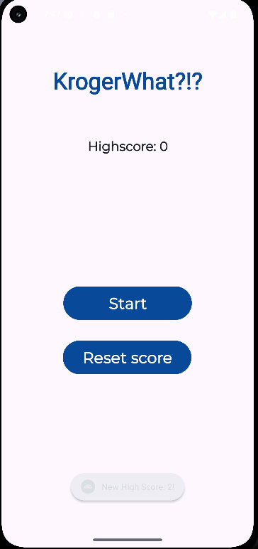

<!-- (This is a comment) INSTRUCTIONS: Go through this page and fill out any **bolded** entries with their correct values.-->

# AND101 Milestone 2 - **Kroger What!?**

Submitted by:
- **Victor Sim**
- **Christian Galvez**
- **Tan Vo**
- **Shang-Kai Wen

Time spent: **17** hours spent in total

## Summary

This document provides a brief overview of our project building process for **Kroger What!?**

## Milestone Requirements

<!-- Please be sure to change the [ ] to [x] for any features you completed.  If a feature is not checked [x], you might miss the points for that item! -->

The following REQUIRED features are completed:

- [X] Assign features to each member of your group
- [X] Establish a goal time for completing each feature

The following REQUIRED files are included:

- [X] Updated 📄 `project_spec.md`, which contains:
  - [X] App Overview (Milestone 1)
  - [X] App Spec (Milestone 1)
  - [X] Checked off 2+ completed features
  - [X] 2+ Videos/GIFs of build progress

- [X] Our 🎥 Demo Video
  - [X] We have also added the Demo Video Link to the Group Info Form on the course portal.

The following EXTRA features are implemented:

- [X] Discord meeting to discuss roles & project development!

## 🎥 Demo Video

Here's a video that demos all of the app's implemented features:

VIDEO created with **ScreenToGif**